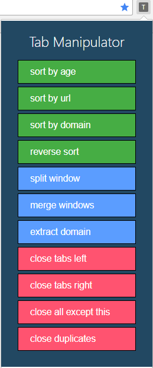
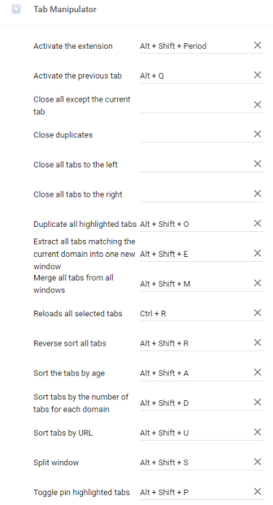

# Tab Manipulator

> A Chrome Extension that sorts tabs, manages windows and closes tabs the way most editors do.

## Installation Guide

- Go to **chrome://extensions**
- Enable developer mode
- Either clone or download and extract the extension
- Drag and drop the folder into extensions page or open it through 'Load unpacked extension'

## Setup Keyboard Shortcuts
- Go to **chrome://extensions/**
- Click on the hamburger menu in the top-left
- Click **Keyboard shortcuts**

## Features

- [x] **Keyboard shortcuts** for each feature
- [x] **Duplicate selected tabs**
- [x] **Toggle pin selected tabs**
- [x] **Reload selected tabs**
- [x] **Close all but this tab**
- [x] **Close duplicate tabs**
- [x] **Close tabs left**
- [x] **Close tabs right** (works well with custom user sort)
- [x] **Extract domain**: moves all tabs with the same domain as the current one to a new window
- [x] **Merge windows**: combines all chrome windows
- [x] **Split window**: moves the current tab and all tabs to the right of it to a new window
- [x] **Sort by number of domain open**: sorts tabs in ascending order by the number of tabs with the same domain open. `u`while the popup is open
- [x] **Sort tabs by age**: shortcut `a` while the popup is open
- [x] **Sort tabs by URL**: shortcut `u`while the popup is open
- [x] **Reverse sort**: shortcut `r`while the popup is open
- [x] **Activate previous tab**

